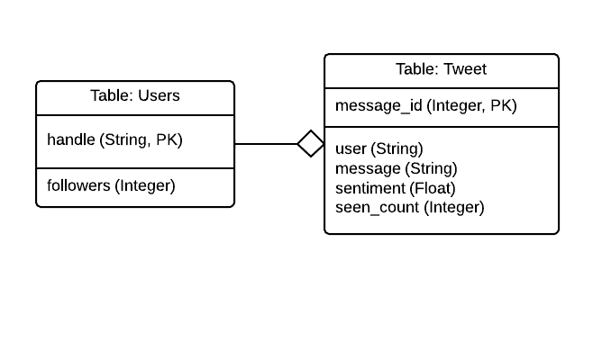

al-sentiment - 
============

A tool to track brand-specific sentiments using Twitter-like APIs

Running
=======

al-sentiment is a standard flask app tested against python 2.7 and 3.3 on OSX and Ubuntu.

To run the web server:

1. Clone the git repository (or unpack from a tarball)
2. Optionally, create a virtual-env and enter that
3. Install the requirements in requirements.txt (`pip install -r requirements.txt`)
4. If it's not executable, make 'runserver' executable `chmod +x runserver`
5. Run the runserver script `./runserver`

By default the server will run with an in-memory database, to specify a
persistent database file, add `--database=/path/to/sqlite3/file`

Database setup is handled automatically by al-sentiment, if the file pointed to
by `--database` is not present, it will be created.

More runtime options are available, and can be seen by running `./runserver --help`

Design
------

`sentiment` is a fairly standard python-flask app, that uses peewee as an ORM layer.

The App code is split into three main modules (under sentiment/):

server.py - responsible for option parsing, providing the webserver endpoints, and running flask
models.py - defines standard peewee models (tracking users and tweets)
feed.py - responsible for interactions with the feed API

The tweet data is persisted to a sqlite3 database, managed by PeeWee, the data model is very simple:

By splitting out the users into a separate table, assumptions were made about what
the 'followers' element of the twitter data represented.  `sentiment` assumes
that the tweet follower field represents the users's current follower count
(at the time the tweet was sent).  The user table is kept up-to-date with
the latest follower count seen for each user, but does not do any timestamp
comparison, so out-of-order tweets coming from the API may affect the correctness
of this value.

Because the Users table is keyed by string, the Tweets table still contains useful information
when queried in the absence of the Users table, because each entry has the handle of the sender
alongside the tweet, this would have implications if users were able to change their handle,
but that information is not available over the API anyway.  

The performance overheads of having an indexed string primary key were not considered
significant for this scenario.

Tests
-----

All tests, and coding style checks are run on travis-ci, the current build status may be
seen at the top of this readme.

Tests are designed to be run by python-nose.  Unit-tests are defined in test modules alongside the
application code (for example sentiment/feed_test.py) and test functionality in the accompanying file.

Integration tests (added more as a demonstration of intent than anything particularly useful at this stage)
are defined separately under the top-level directory: integration/, these tests 
spawn an instance of the web server with an in-memory databse and can be used
to excercise the whole application.  There needs to be a way to specify custom
feed data to the server for more useful testing to be performed.

To run the tests, you may need to install the dependencies in test-requirements.txt
then just call `nosetests` in the top-level directory.

With more time, I would move much of the testing that happens in the integration/ part
into inline tests that use the flask test_app functionality, this would allow for
richer fixture setup (and actually useful tests) The integration/ tests would then
become selenium tests that could use a custom data source to excercise the full
UI and javascript stack.